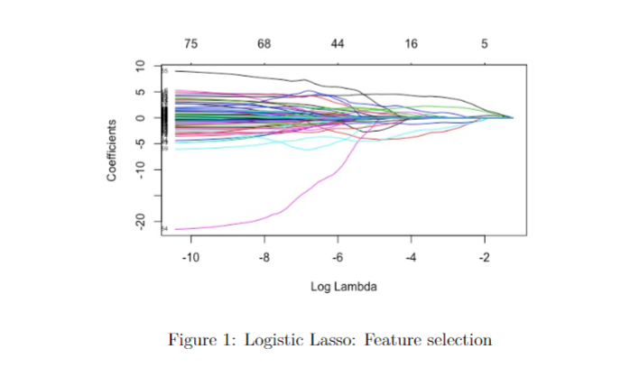
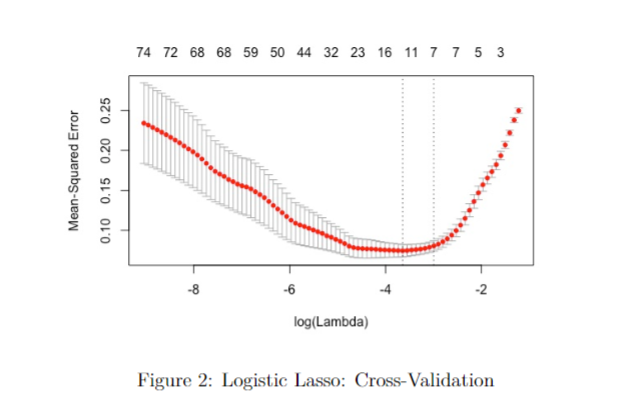
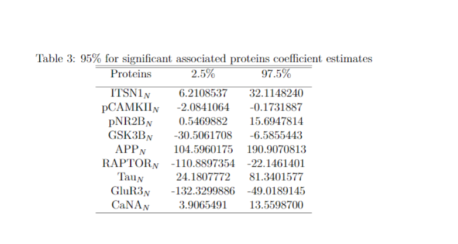
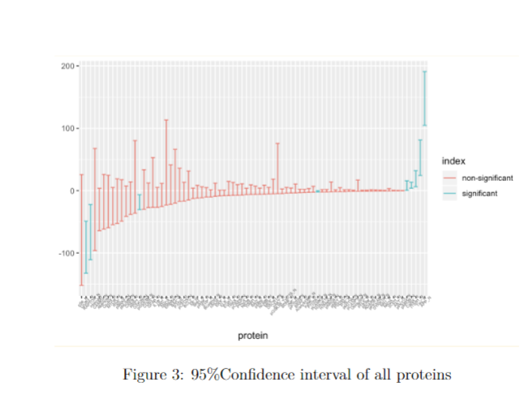

# Introduction

Down syndrome is a genetic disorder caused by abnormal cell division results in chromosome 21. As a genetic disorder, Down syndrome can change the protein expression level which will cause a distinct facial appearance, intellectual disability, and developmental delays. Screening tests exist for Down syndrome, and researchers want to further identify a subset of proteins that are significantly associated with Down syndrome. 

The dataset consists of the expression levels of 77 proteins modifications that produced detectable signals in the nuclear fraction of cortex. We have 1080 mice in which some are controls and others are confirmed to have Down syndrome. We intend to create and train a predictive model to evaluate the effects of protein modification on Down syndrome. The number of predictors is relatively large(77 proteins level) and we intend to apply and compare two similar models: Logist-Lasso model and a bootstrap-smoothed method propose by B.Efron.


# Data Cleaning

The dataset has 1080 rows and 79 columns, and two of which indicate the MouseID and Down syndrome status. The data is already cleaned and almost ready for further study. The value of each protein is based on the log two-fold measurements, and some protein may have a much larger value. We will standardize the dataset to keep the same weight for each protein level. Moreover, we removed all the missing value.The final working dataset has 552 mice obersvations where 255 are controls and 297 have Down syndrome.
```{r, eval=FALSE}
library(tidyverse)
library(glmnet)
library(readr)
set.seed(8160)
library(parallel) # one of the core R packages
library(doParallel)
library(foreach)
library(iterators)
nCores <- 4  # to set manually
registerDoParallel(nCores) 
# standardize the dataset 
standardize = function(x) {
  mean = mean(x)
  sd = sd(x)
  return((x - mean)/sd)
}
Down <- read_csv("Down.csv")
Down <- Down %>%
  mutate(Class = as.factor(Class)) %>%
  select(-MouseID)%>%
  na.omit()

## Seperate varaible for further resampling
y.set <- as.matrix(ifelse(Down$Class == "Control", 0, 1))
x.set <- as.matrix(Down %>% 
                     select( - Class) %>%
                     map_df(.,standardize))

##Get trained and test dataset
training.samples <- Down$Class %>% 
  createDataPartition(p = 0.8, list = FALSE)
x.train  <- x.set[training.samples, ]
x.test <- x.set[-training.samples, ]

y.train <- y.set[training.samples, ]
y.test <- y.set[-training.samples, ]
```


 
# Methodology
Efron proposed a new method, Bootstrap-smoothing approach, to compute standard errorsand confidence intervals that take model selection into account [1]. Bootstrap smoothing help to decrease variance and tame the erratic discontinuities of selection-based estimators.In our project, we applied Efron’s method to our logistic-LASSO algorithm. This gave us anew predictive model which can predict Down syndrome.We created a logistic-Lasso model for 500 bootstrap samples using the glmnet packacge in R.
We first set the empirical data set $y = (y_1,y_2,...y_552)$, where $y_i$ are iid. observations from unknown distribution F. amd $y_i = (y_{i,1},y_{i,2},...,y_{i,78})$ is indicator variable for the ith mouth is a control or have Down syndrome. Secondly, we created a smoothed estimation coefficent and cofidence interval for each variables. Lastly, we average the value over 500 bootstrap steps by Efron's smoothing methodology.

$$
\tilde{\mu}s(y) = \frac{1}{B}\sum^B_{i=1}t(y^*)
$$
where $t(y^*)$ represents the individual regression coefficient.
In order to compare the prediction accuracy of logistic-lasso and bootstrap-smoothingmethod, we calculate the MSE of prediction values with two method.  We can find that the bootstrap-smoothing method create a slightly small MSE comparing with the Logistic-Lasso algorithm. We also conduct an accuracy test in which we calculate the proportionof prediction value which different from the true value.  Both criterion indicate that thebootstrap-smoothing method is more accurate than the logistic-lasso.
$$
\widetilde{sd_B} = \bigg[ \sum^n_{j=1} \widetilde{cov_j}^2 \bigg]^{1/2}
$$

where $\widetilde{cov_j} = \frac{\sum^B_{i=1}(Y^*_{ij} - Y^*_{.j})(t_i^* - t_.^*)}{B}$, bootstrap covariance between $Y^*_{ij}$ and $t^*_{i}$. $Y_{ij}$ represents the number of elements of ith bootstrap replication $y^*_i$ equaling the original data point $y_j$. $t_.^* = \sum^B_{i=1}t^*/B = s(y)$ represents the smoothed bootstrap estimate.$ The smoothed confidence interval is given by the smoothed standard error.

Efron claim that the smoothed confidence interval is smaller than the orignial bootstrap confidence intervals.Since the researchers want to identify a subset of proteins that are significantly associatedwith the Down syndrome, we chose 95 percent confidence interval as the statistical justifica-tions to filter proteins whose coefficient 95%CI do not cover point 0.

$$
s(y) \pm 1.96 \times \widetilde{sd_B}
$$

```{r, eval=FALSE}
set.seed(8160)
boot_smooth <- function(x.train, y.train, x.test, y.test, nboot = 100){
  predictions <- rep(NA,110)
  results <- matrix(rep(NA, nboot*110), nrow =110, ncol = nboot)
  
  results<- foreach(i = 1:nboot, .combine = cbind) %dopar% {
    ## locate poistion by resampling
    boot_location <- sample(nrow(x.train), size = nrow(x.train), replace =T)
    y = y.train[boot_location]
    x = x.train[boot_location,]
    ## tunning parameter lamda
    cv.lasso <- cv.glmnet(x,y, alpha = 1,family = "binomial")
    ## fit model 
    model <- glmnet(x,y, alpha = 1, family = "binomial",lambda = cv.lasso$lambda.min)
    predict(model, newx = x.test, type = "response")
  }
  i <- 1
  while(i < 111){
  predictions[i] <- mean(results[i,])
  i<- i +1
  }
  return (predictions)
}

```
# Results
The 95% confidence interval of coefficient estimates of significant associated proteins basedon bootstrap-smoothing is shown as Table 1.Based on the result of bootstrap-smoothing,we found Down Syndrome appears to be as-sociated with 9 proteins as Figure3. 

Among those proteins:

(1)Under-expression :pCAMKIIN,GSK3BN,RAPTORN,GluR3N

(2)Over−expression:ITSN1N,pNR2BN,APPN,TauN,CaNAN





# References 

1. B. Efron. Model selection, estimation, and bootstrap smoothing. Technical Report Stanford University, (262), 2012.

