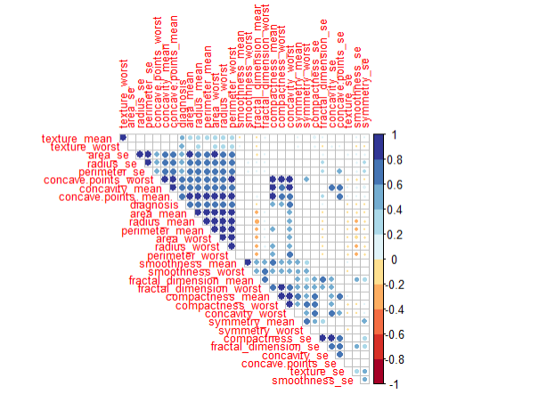

# Introduction

Breast cancer screening is a useful technique to detect breast cancer at an early stage, even before there are signs or symptoms of the disease. Though we have plenty of medical screening test, there is still room to improve it technically and statistically. An effective way is of breast cancer prediction is based on the breast image. 

In this report, we intend to propose a Logistic-Lasso model to select features and predict breast cancer status from the imaging dataset. Two techniques we interest will be the logistic model with Newton-Raphson optimization and the descending pathwise coordinatewise optimization.

# Data Cleaning

The breast cancer dataset has 569 row and 33 columns. That is, there are 569 observations of breast cancer diagnosis (malignant or benign), each with 30 potential features. The three columns that were not useful covariates are: "id," "diagnosis" (outcome variable) and a non-relevant column of NA values. The "diagnosis" outcome variable specifies if the image is coming from a cancer tissue or a benign one.

Lasso is sensitive to the scale of the predictors, so we standardized the dataset to make sure those larger scales predictors will not dominate over those with smaller ranges of values. Many of the columns in the data are highly correlated with each other, so we drop features that show a high correlation, with cutoff 0.85.

```{r, eval=FALSE}
require(knitr)
require(survival)
require(quantreg)
require(glmnet)
require(MASS)
require(pROC)
require(readr)
require(GGally)
library(corrplot)
require(magrittr)
require(dplyr)
require(purrr)
require(matrixcalc)
library(RColorBrewer)
library(tidyverse)
library(modelr)
library(caret)
set.seed(2019)

# Data preparation
dat.original <- read_csv("breastcancer.csv")
dat <- dat.original %>% 
  select(-c(id,X33))

dat$diagnosis <- ifelse(dat$diagnosis == "M", 1, 0)

# Normalization
normalize <- function(x) {
  return((x - mean(x)) / sd(x))
}

# normalize all features
dat.norm <- as.data.frame(lapply(dat[,2:31], normalize))
dat.norm <- cbind(dat$diagnosis, dat.norm)
names(dat.norm)[1] <- "diagnosis"

# Removing columns that have high multicollinearity with others

corr <- cor(dat.norm) 
highCorr <- findCorrelation(corr, cutoff = 0.85, exact = TRUE) 
highCorr.names <- findCorrelation(corr, cutoff = 0.85, exact = TRUE,  names = TRUE) 
dat.norm.use <- dat.norm[,-c(highCorr)]
p.mat <- cor.mtest(corr)$p 
corrplot(corr, method="circle", 
         order = "hclust", 
         type = "upper",
         p.mat = p.mat, 
         sig.level = 0.05, 
         insig = "blank",
         diag = FALSE,
         tl.cex = 0.8,
         col = brewer.pal(n = 10, name = "RdYlBu"))
```
